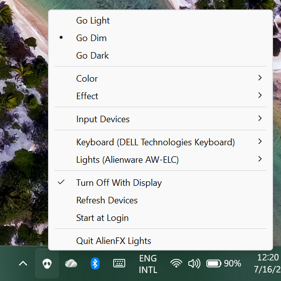

# AlienFX Lights

A tiny **menu bar (macOS)** and **system tray (Windows)** app to control the RGB
lighting of Alienware devices — external and laptop keyboards, mice, monitors and
case/LED controllers — from one simple menu. No dashboards, no background
services, no account.

- **Go Light / Go Dim / Go Dark** — system-wide brightness, your color is kept.
- **Color** — one color for every device (presets + a custom picker).
- **Effect** — Static, Pulse, Morph, Breathing, Spectrum.
- **Input Devices** — Always On / On While Typing / Always Off for all keyboards
  and mice at once, with a per-device override for anything you want different.
- Turn the lights off with the display, re-sync on wake and on hotplug,
  optionally start at login.

It starts **passive**: it never changes your lighting until you pick something in
the menu, so whatever you set elsewhere is preserved.



## Download & install

Grab the ZIP for your platform from the
**[latest release](https://github.com/rodrigogq/AlienFX-Lights/releases/latest)** —
no installer, no admin rights, no background services.

### Windows

1. Download **`AlienFXLights-x.y.z-Windows.zip`** and extract it anywhere
   (e.g. a folder in `Documents`, or `C:\Tools`).
2. Double-click **`AlienFXLights.exe`**. An alien-head icon appears in the
   system tray (check the `^` overflow area next to the clock).
3. Optional: click the icon → **Start at Login** so it's always there.

> **SmartScreen:** the executable is not code-signed, so the first run may show
> "Windows protected your PC". Click **More info → Run anyway**.

### macOS

1. Download **`AlienFXLights-x.y.z-Darwin.zip`** and unzip it.
2. Drag **`AlienFXLights.app`** into **Applications** and open it. The alien-head
   icon appears in the menu bar (there is no Dock icon).
3. Optional: click the icon → **Start at Login**.

> **Gatekeeper:** the app is not notarized, so the first launch may be blocked.
> Right-click the app → **Open** → **Open**, or allow it under
> *System Settings → Privacy & Security*. If a keyboard won't respond, also
> grant **Input Monitoring** under *Privacy & Security → Input Monitoring*.

One shared C++ core drives the AlienFX protocol (API v2–v8, plus a
capture-decoded protocol for the AW920K wireless keyboard) behind a per-platform
HID transport. The UI is native Win32 on Windows and Objective-C++/AppKit on
macOS — no Swift, one toolchain (CMake) for both.

## Repository layout

```
CMakeLists.txt      the whole build (open this folder in your IDE)
src/core/           shared C++ protocol core + HID transports
src/windows/        Win32 tray app
src/macos/          Objective-C++ menu bar app (AppKit)
assets/             icons + macOS Info.plist
scripts/            icon generators (PowerShell / bash)
docs/               notes, incl. the decoded AW920K protocol
```

## Build & run (from source)

The project is plain CMake. Open the repository folder directly in your IDE, or
build from the command line.

### Windows

**Tools to install** (one of):
- [Visual Studio 2022+](https://visualstudio.microsoft.com/) with the
  **“Desktop development with C++”** workload (ships MSVC + CMake), **or**
- [VS Code](https://code.visualstudio.com/) (free) with the **C/C++** and
  **CMake Tools** extensions, plus the
  [Build Tools for Visual Studio](https://visualstudio.microsoft.com/downloads/#build-tools-for-visual-studio-2022)
  (MSVC compiler).

**Open in an IDE:** open the repo folder — Visual Studio (*File → Open → Folder*)
and VS Code (*Open Folder*, then “Configure”) both detect `CMakeLists.txt`
and give you Build/Run. Pick the **Release** configuration.

**Command line** (from a *Developer PowerShell for VS*, so `cmake` and MSVC are on
the path):
```powershell
cmake -B build -A x64
cmake --build build --config Release
.\build\Release\AlienFXLights.exe
```

**Make a release ZIP:**
```powershell
cmake --build build --config Release --target package
# -> build\AlienFXLights-1.0.0-Windows.zip
```

### macOS

**Tools to install:**
- **Xcode** (or the Command Line Tools: `xcode-select --install`) for the
  compiler and the AppKit/IOKit SDKs.
- **CMake** — `brew install cmake` (or the CMake.app).

**Open in Xcode:**
```sh
cmake -B build -G Xcode
open build/AlienFXLights.xcodeproj
```

**Command line:**
```sh
cmake -B build
cmake --build build --config Release
open build/AlienFXLights.app          # Xcode generator: build/Release/AlienFXLights.app
```

**Make a release ZIP:**
```sh
cmake --build build --config Release --target package
# -> build/AlienFXLights-1.0.0-Darwin.zip
```

The app is a menu bar item (no Dock icon). On first run, if a keyboard interface
won’t open, grant **Input Monitoring** under *System Settings → Privacy &
Security → Input Monitoring*.

## Supported devices

| API | Devices | USB Vendor |
|-----|---------|------------|
| v2/v3 | older Alienware laptops/desktops | `187c` |
| v4 | modern Alienware laptop/desktop LED controllers (e.g. AW-ELC) | `187c` |
| v5 | notebook RGB (per-key) keyboards | `0d62` (Darfon) |
| v6 | Alienware monitors | `187c` / `0424` (Microchip) |
| v7 | Alienware mice | `0461` (Primax) |
| v8 | Alienware external (wired) keyboards | `04f2` (Chicony) |
| v10 | Alienware AW920K tri-mode **wireless** keyboard | `413c` (Dell) |

The AW920K protocol was reverse-engineered from a USB capture — see
[docs/aw920k-protocol.md](docs/aw920k-protocol.md). Its animated effects
(Pulse/Morph/Breathing) are experimental; Static and Spectrum are confirmed.

> **Alienware Command Center:** if AWCC is installed, its background services
> (e.g. `AWCC.SCSubAgent`) also drive the lighting and can override this app.
> For deterministic colors, stop those services or uninstall AWCC.

## Diagnostics

If a device is detected but stays dark, or isn’t detected at all:

1. Run `AlienFXLights --list` — every HID interface from Alienware-related
   vendors, whether each matched a protocol, and whether it could be opened.
2. Run `AlienFXLights --test` — cycles red/green/blue/white on every device with
   low-level command logging. Attach its output to bug reports.
3. For extra logging, set `ALIENFX_DEBUG=1` in the environment (`--test` sets it
   automatically).

## How it works

The app talks directly to each device’s vendor HID interface — no kernel
extensions, no drivers. The protocol core in `src/core` is one C++ codebase
shared by both platforms behind a small HID transport interface: IOKit on macOS,
SetupAPI/`hid.dll` on Windows. Lighting state lives in the app and is re-synced
on launch (once you’ve taken control), wake and hotplug.

## Credits & lineage

- Based on **[AlienFX-For-MacOS](https://github.com/kingo132/AlienFX-For-MacOS)**,
  which pioneered running the AlienFX SDK on macOS via IOKit.
- Protocol SDK ported from **[alienfx-tools](https://github.com/T-Troll/alienfx-tools)**
  by T-Troll (MIT) — most of the reverse-engineering credit goes there.
- The monitor (APIv6) init sequence and color block follow
  **[OpenRGB](https://gitlab.com/CalcProgrammer1/OpenRGB)**’s
  AlienwareMonitorController by Adam Honse (GPL-2.0-or-later), verified on real
  hardware.

## License

[GPLv3](LICENSE). The upstream `alienfx-tools` code it derives from is
MIT-licensed by T-Troll; the monitor code derives from OpenRGB (GPL-2.0-or-later).
